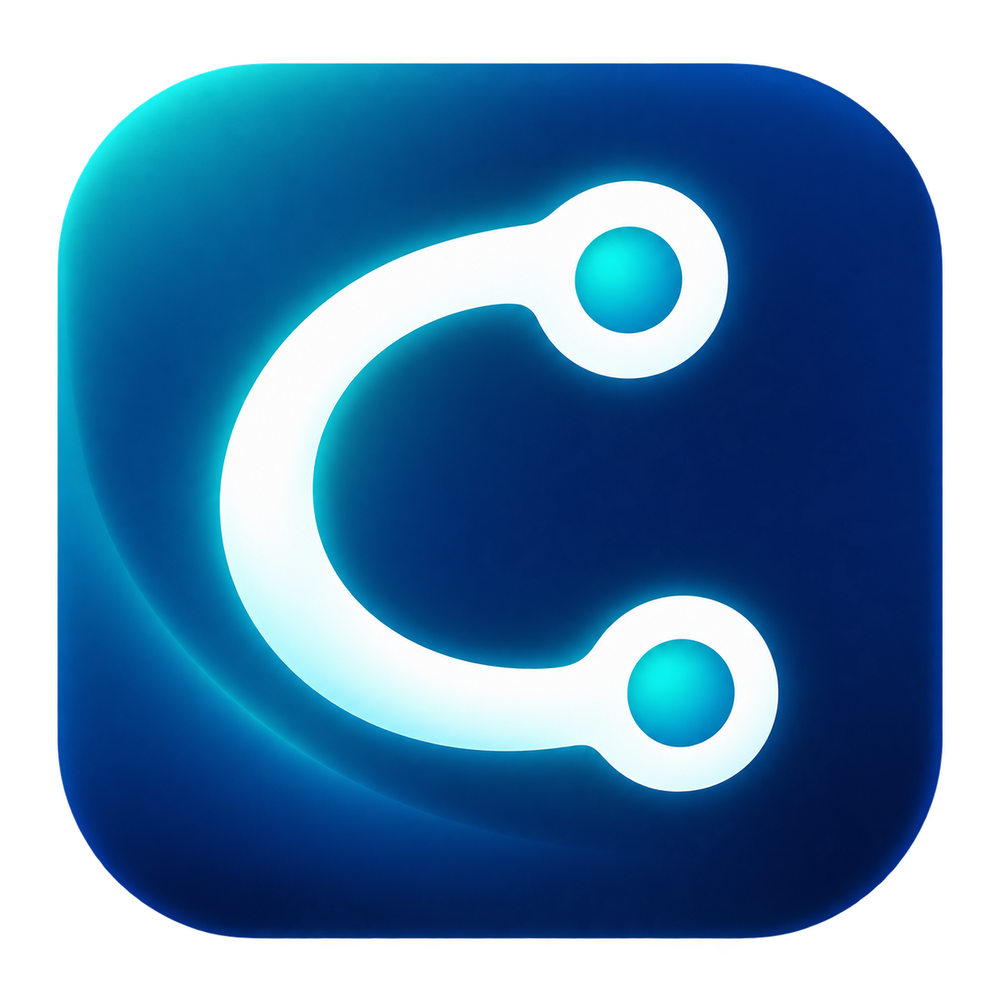
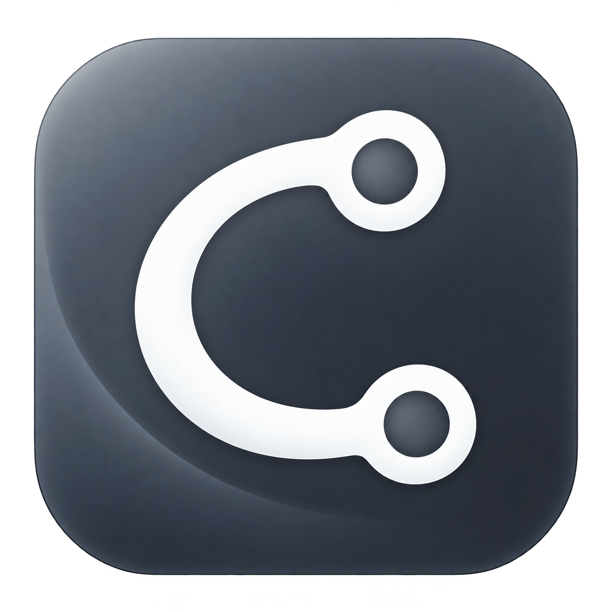

# Clash Tray

<p>
  
  
</p>

使用 Rust 编写的轻量 Windows 托盘工具，用于管理 Mihomo 内核。程序通过原生系统托盘提供操作入口，无主窗口，启动内核时不显示控制台窗口。

本项目仅负责内核进程管理，不内置 Mihomo、订阅管理或配置编辑器。

## 功能

- 程序启动后自动启动 Mihomo，也可通过托盘菜单手动启停，并用图标显示运行状态。
- 捕获内核标准输出和标准错误，支持使用记事本查看日志。
- 从 GitHub Release 检查并下载 Mihomo 更新。
- 更新前备份内核，替换失败时尝试恢复旧版本。
- 设置当前用户登录时自动启动托盘程序。
- 退出托盘时停止由本程序启动的内核。

## 构建环境

- Windows 10 / 11。
- Rust stable，支持 Rust 2024 edition；已在 Rust 1.93.1、Windows x64 环境验证。
- Visual Studio C++ Build Tools，包含 MSVC 工具链和 Windows SDK。

首次构建需要下载 Cargo 依赖。项目使用原生 Windows API，不依赖 WebView。

## 编译与开发

在项目根目录执行：

```powershell
# 编译发布版本
cargo build --release --locked

# 开发模式运行
cargo run --locked
```

发布产物为 `target/release/ClashTray.exe`。开发模式的程序位于 `target/debug/`，其内核、配置和日志也以该目录为基准。

代码检查与测试：

```powershell
cargo fmt --check
cargo check --locked
cargo test --locked
cargo clippy --all-targets --locked -- -D warnings
```

项目也提供调用 Cargo 命令的 Makefile；安装 Make 后可使用 `make build`、`make run`、`make test` 和 `make check`。

## 部署与运行

可从本仓库 GitHub Releases 下载 `ClashTray-v版本号-windows-x64.zip`，解压后按下方说明准备内核和配置。发布包附带 SHA-256 校验文件，不包含内核和用户配置。

将编译后的程序放入可写目录，按以下结构准备内核和配置：

```text
ClashTray/
├── ClashTray.exe
├── mihomo.exe
└── config/
    └── config.yaml
```

Mihomo 所需的其他数据文件也放在 `config/` 中。程序始终以自身 EXE 所在目录查找文件，不依赖启动时的工作目录。

1. 双击 `ClashTray.exe`，程序会显示托盘图标并自动启动 Mihomo。
2. 右键图标可查看日志；手动停止后，可选择“启动 Clash”再次启动 Mihomo。
3. 选择“停止 Clash”停止内核，或选择“退出”同时关闭内核和托盘程序。

自动启动失败时会显示错误提示，托盘仍保持运行。尚未安装 Mihomo 时，可选择“更新 Mihomo”下载内核；准备好 `config/config.yaml` 后，再通过“启动 Clash”启动。

### 日志

选择“显示日志”会使用记事本打开程序目录下的 `mihomo.log`。

日志同时记录内核 stdout、stderr 及程序错误信息。文件超过 10 MiB 后，在后续写入时轮转为 `mihomo.log.1`，保留一个备份。

### 内核更新

选择“更新 Mihomo”后，程序会检查 GitHub 上的最新版本。当前版本相同时跳过下载，否则先下载并解压到程序目录中的临时目录，再停止正在运行的内核并替换文件。

原内核备份为 `mihomo.exe.bak`。替换失败时尝试恢复；更新前处于运行状态的内核会尝试重新启动。下载期间启停菜单不可用，已有内核继续运行，仍可退出托盘。

更新资源按托盘程序的编译架构选择，支持 x64 compatible、ARM64 和 x86 的资源名称。当前构建验证仅覆盖 Windows x64。更新需要能够访问 GitHub API 和 Release 下载地址。

### 自启动与权限

勾选“开机自启动”后，程序会将自身路径写入当前用户的注册表 Run 项，在该用户登录时启动托盘。移动程序后，应在新位置重新设置自启动。

程序默认以普通用户权限运行。使用 TUN 模式且需要管理员权限时，请右键 EXE 选择“以管理员身份运行”。登录自启动同样会自动启动 Mihomo，但不会自动提权。代理监听端口、规则和 TUN 是否启用由 `config/config.yaml` 决定；托盘程序不修改 Windows 系统代理设置。

## 项目结构

```text
src/
├── main.rs         # 托盘菜单、Win32 消息循环和应用状态
├── process.rs      # 内核进程管理、输出捕获和日志轮转
├── update.rs       # 版本检查、下载解压、备份与恢复
└── autostart.rs    # 当前用户自启动设置
build.rs            # 编译 Windows EXE 图标资源
Cargo.toml          # Rust 包配置与依赖
Cargo.lock          # 锁定依赖版本
app-enable.ico      # 内核运行状态图标
app-disable.ico     # 内核停止状态图标
Makefile            # Cargo 命令快捷入口
.github/workflows/  # 自动检查、构建及标签发布
scripts/package.ps1 # 打包 EXE、说明文档和许可证，生成校验文件
assets/icons/       # 图标 PNG 原图及设计说明
examples/prepare_icons.rs # 生成多尺寸 ICO 的 Rust 工具
```

主要依赖：`tray-icon` 提供托盘菜单，`windows-sys` 和 `winreg` 对接 Windows API，`reqwest` 处理 HTTP 请求，`serde` 解析版本信息，`zip` 和 `tempfile` 处理更新包，`image` 解码图标，`winresource` 编译 EXE 资源。

## GitHub Actions 编译与发布

工作流位于 `.github/workflows/build-release.yml`，使用 Windows x64 MSVC 和 Rust 1.93.1：

- 推送任意分支、提交 PR 或手动运行：检查格式、运行 Clippy 和测试、编译 Release，并上传 ZIP 与 SHA-256 文件到 Actions Artifacts（保留 14 天）。
- 推送 `v*` 标签：在构建成功后创建 GitHub Release，并上传同一份构建产物。含 `-` 的版本标签发布为预发布版本。
- 标签必须与 `Cargo.toml` 中的版本严格一致，例如 `version = "2.0.0"` 对应 `v2.0.0`。

将工作流和代码提交、推送到 GitHub 后，在准备发布的提交上执行：

```powershell
git tag v2.0.0
git push origin v2.0.0
```

版本号示例应替换为实际版本，已发布的标签不要重复使用。发布使用 GitHub 自动提供的 `GITHUB_TOKEN`，仅发布任务申请 `contents: write`；无需额外配置个人访问令牌。仓库或组织需允许运行 Actions。手动运行入口通常要求工作流已存在于默认分支。

本地可复用相同的打包步骤：

```powershell
cargo build --release --locked
./scripts/package.ps1
```

产物位于 `dist/`。托盘与 EXE 图标包含 16、20、24、32、40、48、64、128、256 像素版本。更新 PNG 原图后，可重新生成 ICO：

```powershell
cargo run --locked --example prepare_icons -- assets/icons/running.png app-enable.ico
cargo run --locked --example prepare_icons -- assets/icons/stopped.png app-disable.ico
```

## 许可证

Apache-2.0，详见 LICENSE。
